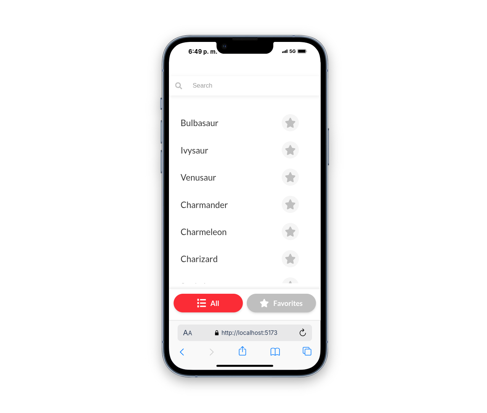
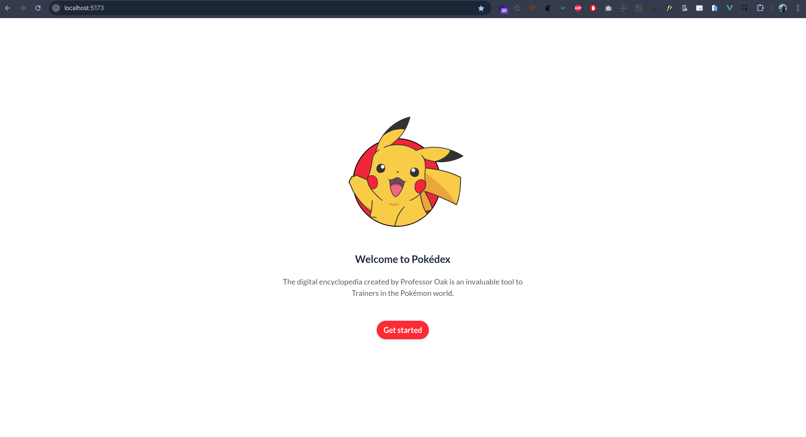
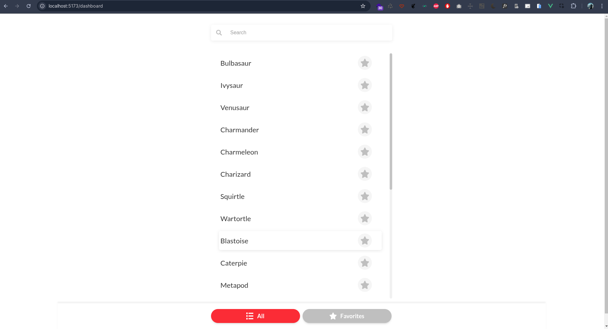
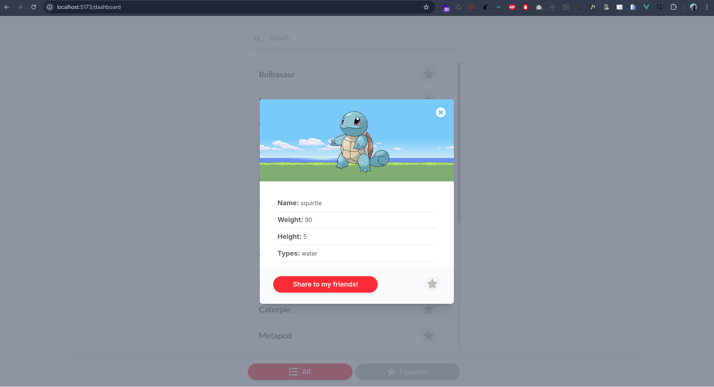

# Global66 test

## Tecnologías usadas

Para este proyecto se tiene en cuenta el uso de las siguientes tecnologías:

- [Vue 3](https://vuejs.org/)
- [Vite](https://vite.dev/)
- [Tailwind css](https://tailwindcss.com/)
- [Vue-router](https://router.vuejs.org/)
- [Axios](https://axios-http.com/es/docs/intro)
- [Typescript](https://www.typescriptlang.org/)
- [Vitest](https://vitest.dev/)

Se hace uso de estas tecnologías pensando en el desarrollo agil que nos da Vue3 y lo veloz que alcanza a ser si lo usamos de una manera adecuada. Así mismo para llevar un control de la información lo implementamos con `Typescript`, en un principio se pensó hacer uso de `Pinia` el cual puede ser de mucha utilidad si queremos darle una permanencia a los datos aún si recargamos la página, pero bueno, este no fue el caso. 
Y por último se realiza implementación de `Vitest` el cual nos permite darle un enfoque un poco más fuerte si tenemos en cuenta algunas pruebas desde el lado de desarrollo.

## Loader

Para el loader se da una espera de `2 segundos` para que el usuario alcance a ver un poco la animación que se ha realizado; sin embargo, se habilita la ruta `/loader` para que pueda verlo completamente.

## Instalación

Para poder correr el proyecto en tu entorno local puedes realizar los siguientes pasos.

1. Si no cuentas con el link del repositorio puedes encontrarlo [Aquí](https://github.com/10075016-22/global66-test).
2. Una vez ubicados en el enlace, en tu pc abre una terminal y en la ruta de tu preferencia ejecuta el siguiente comando

```
git clone git@github.com:10075016-22/global66-test.git
```

Si no cuentas con una `ssh` puedes intentarlo con `https`

```
git clone https://github.com/10075016-22/global66-test.git
```
Y luego autenticarte con tus credenciales.

3. Luego de haber hecho una copia del repositorio, desde la terminal entra a la carpeta 
```bash
cd global66-test
```

o  usa el nombre que le hayas dado

4. Ejecuta los siguientes comandos

_Antes de continuar ten presente que tu versión de node sea compatible para poder realizar la operación_ 

Esta es la versión que yo usé: `Node V18.20.3` 

```bash
npm install
```

```bash
npm run dev
```
Happy coding :smile

## Screenshot

Aquí te muestro algunos screenshot de cómo quedó 
### Movil





### Web







